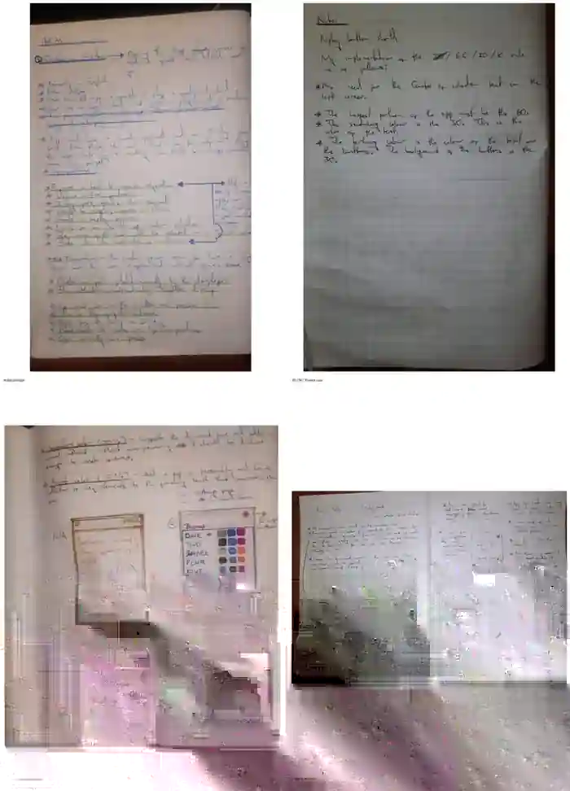

# Quotes of Wisdom

Quotes of Wisdom is an Android quote app built for RevenueCat Shipaton 2026. It uses Kotlin, Jetpack Compose, Android Text-to-Speech, and RevenueCat.

Everything except purchases runs locally. There are no accounts, ads, analytics, or custom servers. The current v1 build is a release candidate; judge builds and the Google Play release are handled separately.

## Highlights

- 1,063 curated quotes from 356 authors, with provenance records
- no-repeat browsing and favorite-based personalization
- favorites, attributed sharing, daily streaks, and local reminders
- Android Text-to-Speech with replay, engine, voice, and speed controls
- 100 three-color themes using a strict 60/30/10 system
- 30-day trial, text-only grace period, locked state, and Pro access
- RevenueCat weekly, monthly, lifetime, and restore-purchase paths
- full-screen Jetpack Compose UI with display-cutout handling
- no ads, login, analytics SDK, or custom backend

## Development notes

Some of the original handwritten notes and UI sketches are kept in [`docs/development-notes/`](docs/development-notes/). They are historical and include ideas that changed before release.



## Build from source

### Requirements

- JDK 17
- Android SDK Platform 36
- Android SDK Build Tools 36.0.0
- Git
- `curl` and `unzip` on macOS/Linux for the one-time Gradle bootstrap

The repository pins Gradle 9.5.0. Gradle does not need to be installed globally.

### macOS / Linux

```bash
git clone https://github.com/noob-express3000/quotes_of_wisdom.git
cd quotes_of_wisdom
chmod +x bootstrap-gradle.sh
./bootstrap-gradle.sh
./gradlew :app:assembleDebug
```

APK:

```text
app/build/outputs/apk/debug/app-debug.apk
```

### Windows

```powershell
git clone https://github.com/noob-express3000/quotes_of_wisdom.git
cd quotes_of_wisdom
Set-ExecutionPolicy -Scope Process Bypass
.\bootstrap-gradle.ps1
.\gradlew.bat :app:assembleDebug
```

APK:

```text
app\build\outputs\apk\debug\app-debug.apk
```

### Optimized QA / judge build

The normal debug APK is debuggable and can run slower than the release-like QA variant. Use the QA build for performance testing and judge evaluation:

```bash
./gradlew :app:assembleQa
```

APK:

```text
app/build/outputs/apk/qa/app-qa.apk
```

QA is minified, resource-shrunk, debuggable, and connected to RevenueCat's Test Store. It is **not** a Google Play production artifact and test purchases do not charge real money.

A local QA build uses that computer's Android debug keystore. GitHub Actions uses a stable test-only CI signer so later CI judge builds can update earlier ones. If an older APK was signed differently, uninstall it once before installing the CI build. Google Play production signing uses a separate identity.

## RevenueCat configuration

Debug and QA builds use the RevenueCat Test Store public SDK key included in the Android client configuration. This allows purchase flows to be tested without private credentials.

A release build reads the public RevenueCat Google Play Android SDK key from the Gradle property `REVENUECAT_API_KEY`:

```bash
./gradlew :app:bundleRelease -PREVENUECAT_API_KEY=goog_your_public_sdk_key
```

Release builds fail before compilation if the key is missing, is a Test Store key, or does not begin with `goog_`. Production signing configuration and private keystore material are not included in the repository. The command above validates and builds the release path but does not create a production-signed upload by itself.

RevenueCat configuration expected by the app:

| Type | Identifier | Grants |
|---|---|---|
| Entitlement | `pro_access` | All Pro access |
| Weekly product | `qow_weekly` | `pro_access` |
| Monthly product | `qow_monthly` | `pro_access` |
| Lifetime product | `qow_lifetime` | `pro_access` |

All three products must be attached to RevenueCat's Current Offering as weekly, monthly, and lifetime packages. The UI displays localized prices supplied by RevenueCat/the store. It does not infer location or use fallback prices.

## Architecture

The app is local-first and has no login or custom backend.

```text
Jetpack Compose UI
        |
        v
HomeViewModel / UI state
        |
        +---- AssetQuoteRepository -> bundled quotes.json
        |
        +---- AppPreferencesRepository -> Android DataStore
        |
        +---- TtsController -> Android TextToSpeech
        |
        +---- RevenueCatController -> RevenueCat SDK
        |
        +---- DailyWisdomNotifications -> AlarmManager / notifications
```

Important source areas:

```text
app/src/main/java/com/shipaton/quotesofwisdom/MainActivity.kt
app/src/main/java/com/shipaton/quotesofwisdom/ui/home/
app/src/main/java/com/shipaton/quotesofwisdom/ui/settings/
app/src/main/java/com/shipaton/quotesofwisdom/ui/paywall/
app/src/main/java/com/shipaton/quotesofwisdom/billing/
app/src/main/java/com/shipaton/quotesofwisdom/speech/
app/src/main/java/com/shipaton/quotesofwisdom/notifications/
app/src/main/java/com/shipaton/quotesofwisdom/data/
app/src/main/assets/quotes.json
```

## Verification

Run the same core checks used by CI:

```bash
python3 tools/validate_production_quotes.py app/src/main/assets/quotes.json
./gradlew :app:testDebugUnitTest :app:lintQa :app:assembleDebug :app:assembleQa
```

GitHub Actions validates the quote database, runs unit tests and Android lint, builds debug and QA APKs, checks the CI signature, and validates the minified release app-bundle path with a non-production CI key.

Automated tests currently cover quote-deck behavior, access-state logic, RevenueCat entitlement transitions, and theme palette rules. Device testing and paywall interaction checks are still done before release.

## Toolchain

- Android Gradle Plugin: 9.3.0
- Gradle: 9.5.0
- Kotlin / Compose compiler plugin: 2.3.21
- Compose BOM: 2026.04.01
- RevenueCat Android SDK: 10.18.1
- compileSdk / targetSdk: 36
- minSdk: 23 (Android 6.0)
- JDK: 17

## Documentation

- [`docs/PROJECT_STATE.md`](docs/PROJECT_STATE.md) — implementation and release state
- [`docs/product-spec.md`](docs/product-spec.md) — v1 behavior and visual rules
- [`docs/SHIPATON_SUBMISSION.md`](docs/SHIPATON_SUBMISSION.md) — judge path, demo script, and submission copy
- [`docs/RELEASE_CHECKLIST.md`](docs/RELEASE_CHECKLIST.md) — judge and Google Play gates
- [`docs/PRIVACY_POLICY_DRAFT.md`](docs/PRIVACY_POLICY_DRAFT.md) — policy draft requiring owner/contact details
- [`docs/TERMS_OF_USE_DRAFT.md`](docs/TERMS_OF_USE_DRAFT.md) — subscription and product-terms draft
- [`docs/DATA_SAFETY_DRAFT.md`](docs/DATA_SAFETY_DRAFT.md) — current Google Play disclosure mapping
- [`docs/quote-curation-policy.md`](docs/quote-curation-policy.md) — corpus acceptance rules
- [`docs/quote-verification-ledger.md`](docs/quote-verification-ledger.md) — quote-level verification record
- [`docs/development-notes/`](docs/development-notes/) — early handwritten notes and UI sketches

## License

The original application code, build tooling, documentation, and corpus selection/arrangement/metadata are available under the [Apache License 2.0](LICENSE).

Individual historical quotation texts remain attributed to their respective authors and are not claimed as original project authorship. The code license does not create new rights in those underlying words. See [`NOTICE`](NOTICE) and the quote provenance/rights records under [`docs/`](docs/).
